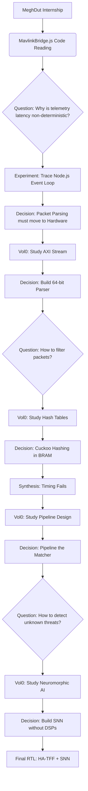

# Decision Graph

This graph maps how knowledge and questions cascaded into physical architecture decisions.

```mermaid
graph TD
    %% Phase 1: Software Limits
    A[MeghDut Internship] --> B(MavlinkBridge.js Code Reading)
    B --> C{Question: Why is telemetry latency non-deterministic?}
    C --> D[Experiment: Trace Node.js Event Loop]
    D --> E[Decision: Packet Parsing must move to Hardware]

    %% Phase 2: Hardware Datapath
    E --> F[Vol0: Study AXI Stream]
    F --> G[Decision: Build 64-bit Parser]
    G --> H{Question: How to filter packets?}
    H --> I[Vol0: Study Hash Tables]
    I --> J[Decision: Cuckoo Hashing in BRAM]

    %% Phase 3: Hardware Reality
    J --> K[Synthesis: Timing Fails]
    K --> L[Vol0: Study Pipeline Design]
    L --> M[Decision: Pipeline the Matcher]

    %% Phase 4: SNN Extension
    M --> N{Question: How to detect unknown threats?}
    N --> O[Vol0: Study Neuromorphic AI]
    O --> P[Decision: Build SNN without DSPs]
    P --> Q[Final RTL: HA-TFF + SNN]
```
